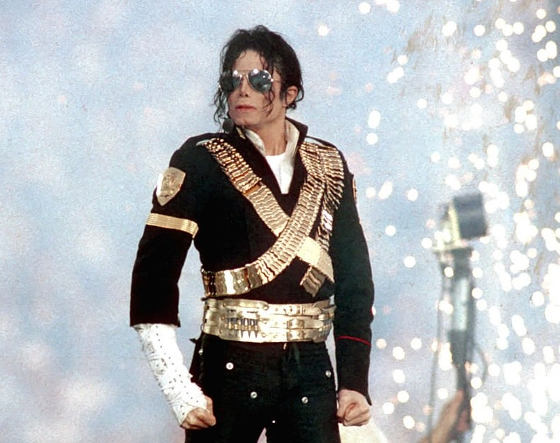

<!DOCTYPE html>
<html lang="en">
<head>
<meta charset="UTF-8">
<meta name="viewport" content="width=device-width, initial-scale=1.0">

<title>The Guess Who? | Mystery Celebrity</title>

</head>

<body>

<!-- =====================================
     HEADER
====================================== -->

    

        WOW!
    

    

        WHO IS IT?
    

    
        THE GUESS WHO?
    

    <h1>
        WHO AM I?
    </h1>

    

        Look at the clues. Discover the details.
        Then make your guess!
    

<!-- =====================================
     MYSTERY IMAGE
====================================== -->

    

        🕺

        

            MYSTERY PERSON
        

    

    

<!-- =====================================
     PROGRESS
====================================== -->

    CLUES DISCOVERED

    

    

<!-- =====================================
     CLUE GAME
====================================== -->

    

        CLUE #1

    

    

        I popularized complex dance moves,
        including the gravity-defying lean.

    

    

        <button
            class="next-button"
            id="nextButton">

            NEXT CLUE →

        </button>

    

<!-- =====================================
     VOTING
====================================== -->

    <h2>
        WHO DO YOU THINK I AM?
    </h2>

    

        You've seen all the clues.
         
        Now make your guess!
    

    

        <button class="choice">
            Michael Jackson
        </button>

        <button class="choice">
            Elvis Presley
        </button>

        <button class="choice">
            Bruno Mars
        </button>

        <button class="choice">
            Usher
        </button>

    

<!-- =====================================
     REVEAL
====================================== -->

    

        

            THE ANSWER IS...
        

        

            MICHAEL JACKSON
        

        

        

            

                Michael Jackson was an American singer,
                songwriter and dancer.
            

            

                He began his career as a child star,
                performing alongside his brothers in
                the Jackson 5.
            

            

                He later became one of the most
                recognizable performers in the world.
            

        

        

            ⭐ FUN FACT ⭐

              

            Michael Jackson's 1982 album
            <i>Thriller</i> became the best-selling
            album in recorded music history.

        

        <button
            class="play-again"
            onclick="restartGame()">

            ↻ PLAY AGAIN

        </button>

    

    ✦ Made for English learning ✦
    The Guess Who?

</body>
</html>
